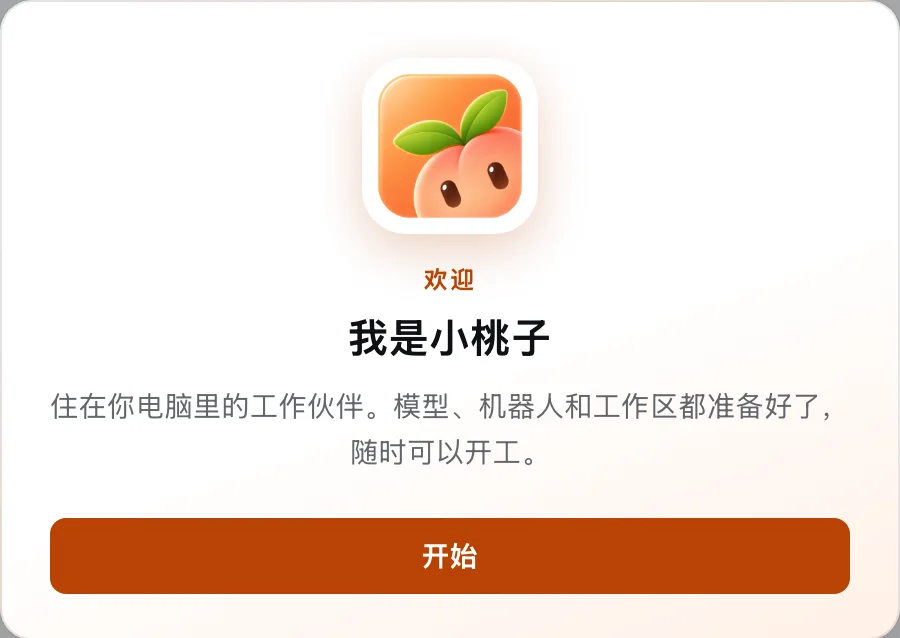
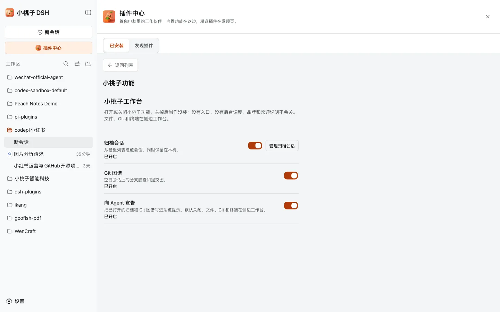
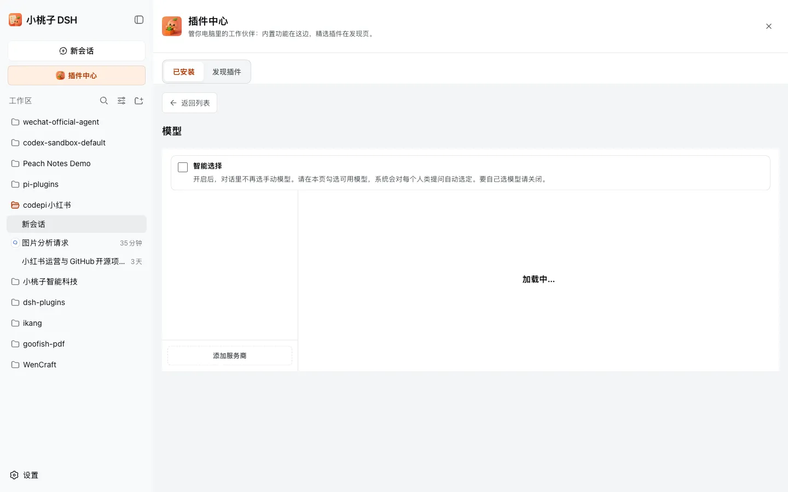
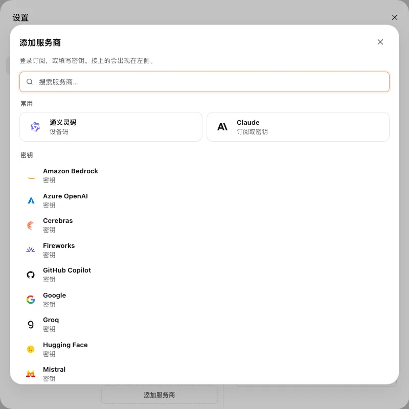

<h1 align="center">xiaotaozi-dsh</h1>

<p align="center">
  <a href="plugins/providers"></a>
  <a href="plugins/im"></a>
  <a href="plugins/xtz-ui"></a>
  <a href="plugins/sidebar"></a>
  <a href="plugins/market"></a>
</p>

<p align="center"><b>Xiaotaozi DSH: the xtz CLI as the user product, plus a shared DeepSeek Harness plugin layer.</b></p>

<p align="center">
  <a href="./README.md">English</a> ·
  <a href="./README.zh.md">中文</a> ·
  <a href="docs/conventions.md">Conventions</a> ·
  <a href="docs/workflow.md">Workflow</a> ·
  <a href="https://github.com/deepseek-ai/deepseek-harness">DeepSeek Harness</a>
</p>

<p align="center">
  <a href="https://github.com/kedoupi/xiaotaozi-dsh/stargazers"></a>
  <a href="https://github.com/kedoupi/xiaotaozi-dsh/issues"></a>
  <a href="LICENSE"></a>
  <a href="https://github.com/topics/dsh-plugin"></a>
  <a href="https://nodejs.org"></a>
  
</p>

Xiaotaozi DSH is a product bundle on [DeepSeek Harness](https://github.com/deepseek-ai/deepseek-harness): the `xtz` command in [`apps/cli/`](apps/cli/) is what users install, and `plugins/` is the capability layer it seeds. Something broken, or a plugin missing? [Open an issue](https://github.com/kedoupi/xiaotaozi-dsh/issues).

## Quick start

Requires Node.js `^22.19.0 || >=24.0.0` on `PATH`:

```bash
npm install -g xiaotaozi-dsh-cli
xtz start
```

The first `xtz start` prepares the official web profile and seeds every first-party plugin under `plugins/`, then serves the UI in your browser. Prefer one command? The install script (`curl -fsSL https://raw.githubusercontent.com/kedoupi/xiaotaozi-dsh/main/apps/cli/scripts/install.sh | sh`) and `bun add -g xiaotaozi-dsh-cli` install the same CLI; `xtz` still runs on Node.

Open commands: help/version, `start`/`web`, `stop`, `restart`, `open`, `status`, `config path`, `doctor`. Disabled by design: `init`, `plugin`, `run`/`ask`, `config dump`/`defaults`, `update`. `xtz` only manages a process it started and never steals port 3080. Full command and safety contract: [`apps/cli/README.md`](apps/cli/README.md).

## What you get

- **Models** — official subscription login and API keys on one page; chat lists only the models you checked.
- **IM bots** — nine chat channels (Feishu, WeChat, Slack, and more) plus an experimental AI Office connector, all from the sidebar.
- **WeCom office** — calendar, docs, meetings, contacts, sheets, todos, and disk through the official `wecom-cli`.
- **Xiaotaozi chrome** — brand UI, archive, task board, and git graph with per-feature toggles.
- **Sidebar workbench** — files, editor, Git, and terminal in a right-hand panel.
- **Market** — a curated third-party plugin catalog with one-click install.

## See Xiaotaozi DSH

A selected product journey gallery, in the order a user meets each surface:

The welcome overlay greets users the first time the web app opens.



Settings → Xiaotaozi turns brand chrome, archive, task board, and git graph on or off per feature.



Settings → Models shows connected vendors and the models chat will offer.



Add provider lists every vendor a user can still sign in to or key in.



The IM bot hub lists nine chat channels, each one click from connecting a bot.


Manual bot setup asks only for a Bot Token; nothing else is stored in the client.


The Market catalog lists curated third-party plugins with search and tabs.


The plugin detail page shows version, source, and the exact install specification.


## Plugins

One installable package per job; every first-party plugin is seeded on the first `xtz start`. Each plugin also builds standalone from `github:kedoupi/xiaotaozi-dsh#path:plugins/<slug>`.

| Package | Occupies | What it does |
| :-- | :-- | :-- |
| [`dsh-providers`](plugins/providers) | Settings → **Models** | Vendor sign-in, API keys, and model selection. [EN](plugins/providers/README.md) · [中文](plugins/providers/README.zh.md) |
| [`dsh-im`](plugins/im) | Sidebar → **IM bots** | Nine chat channels plus an experimental AI Office connector. [EN](plugins/im/README.md) · [中文](plugins/im/README.zh.md) |
| [`dsh-wecom-office`](plugins/wecom-office) | WeCom robot card in **IM bots** | WeCom calendar, docs, meetings, contacts, sheets, todos, and disk via `wecom-cli`. [EN](plugins/wecom-office/README.md) · [中文](plugins/wecom-office/README.zh.md) |
| [`dsh-xtz-ui`](plugins/xtz-ui) | Settings → **Xiaotaozi** | Brand chrome, archive, task board, git graph, and feature toggles. [EN](plugins/xtz-ui/README.md) · [中文](plugins/xtz-ui/README.zh.md) |
| [`dsh-sidebar`](plugins/sidebar) | Settings → **Side card** | Right-hand files / editor / Git / terminal panel. [EN](plugins/sidebar/README.md) · [中文](plugins/sidebar/README.zh.md) |
| [`dsh-market`](plugins/market) | Sidebar → **Market** | Curated third-party catalog; click **Install** to add a plugin. [EN](plugins/market/README.md) · [中文](plugins/market/README.zh.md) |

## Third-party Market

The Market installs third-party plugins from their upstream Git/npm sources; this repo only keeps the catalog rows in `plugins/market` (`MARKET_PLUGINS`) and never vendors those repos. Current entries: [Agent Teams](https://github.com/NanmiCoder/dsh-agent-teams), [Session Context](https://github.com/bowenliang123/dsh-context), and [OpenContext](https://github.com/melandlabs/opencontext).

## Official vs sandbox

Two Harness homes, never mixed:

| | Official (users) | Sandbox (plugin development) |
| :-- | :-- | :-- |
| Home | `~/.dsh` | `<repo>/.dsh-home` (gitignored) |
| Command | `xtz start` | `pnpm dev` |
| Port | **3080** | **3081** |
| Plugins | Seeded by first `xtz start`; extras via `dsh plugin --profile web add` | `link:` from this workspace |

`xtz` and official installs never touch the sandbox; sandbox tooling never touches `~/.dsh`.

## Learn more

- Contributor entry: [CONTRIBUTING.md](CONTRIBUTING.md); hard rules for agents: [AGENTS.md](AGENTS.md)
- Spec: [docs/conventions.md](docs/conventions.md); procedures: [docs/workflow.md](docs/workflow.md); doc map: [docs/README.md](docs/README.md)
- Product snapshots: [CHANGELOG.md](CHANGELOG.md); pinned versions: [versions.json](versions.json)
- CLI contract and source: [`apps/cli/`](apps/cli/)

## License

[MIT](LICENSE)
