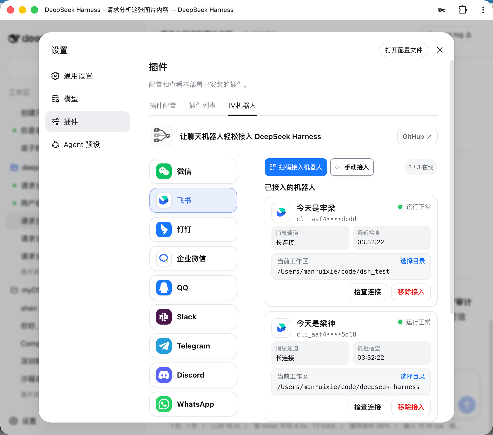

<h1 align="center">dsh-plugins</h1>

<p align="center"><b>可独立安装的 DeepSeek Harness 插件库。一个包做一件事，不要把仓库根当插件装。</b></p>

<p align="center">
  <b>dsh-providers</b> · <b>dsh-memory</b> · <b>dsh-im</b> · <b>dsh-hello</b>
</p>

<p align="center">
  设置 → <b>模型</b> · <b>记忆</b> · 插件 → <b>IM机器人</b> · 小桃子欢迎弹框
</p>

<p align="center">
  <a href="./README.md">English</a> ·
  <a href="./README.zh.md">中文</a> ·
  <a href="docs/conventions.zh.md">规范</a> ·
  <a href="docs/workflow.zh.md">流程</a> ·
  <a href="https://github.com/deepseek-ai/deepseek-harness">DeepSeek Harness</a>
</p>

<p align="center">
  <a href="https://github.com/kedoupi/dsh-plugins/stargazers"></a>
  <a href="https://github.com/kedoupi/dsh-plugins/issues"></a>
  <a href="LICENSE"></a>
  <a href="https://github.com/topics/dsh-plugin"></a>
  <a href="https://nodejs.org"></a>
  
</p>

[DeepSeek Harness](https://github.com/deepseek-ai/deepseek-harness) 从 Git 或 npm 装插件。这是小桃子的插件目录：`plugins/` 下一个目录就是一个 npm 包（`dsh-<slug>`）。根目录是 pnpm workspace，不是插件，不要对它执行 `dsh plugin add`。

出了问题，或还缺某个插件？[提个 issue](https://github.com/kedoupi/dsh-plugins/issues)。

## 特性

- **一个包做一件事。** 模型、记忆、IM 机器人、欢迎弹框各自安装。Git 安装一律是 `github:kedoupi/dsh-plugins#path:plugins/<slug>`。
- **界面中文，默认英文文档。** 小桃子插件给用户看的文案是中文。对外 README 默认英文，中文在 `README.zh.md`。
- **日常环境和沙箱分开。** 日常 Harness 继续用 `~/.dsh`（端口 3080）。本仓库用 `pnpm dev` 起 `.dsh-home`（端口 3081），开发不会改掉日常 profile。
- **默认 Host，有 UI 再 mixed。** `pnpm new` 默认 host。只有设置页、Slot、主题才加 `src/client`。
- **Git 路径安装在用户机器上构建。** 每个插件把 `prepare` / `tsdown.config.ts` 留在包内，这样 `github:…#path:plugins/<slug>` 不必依赖整个 workspace 也能编过。

## 插件

| 包 | 占用 | 做什么 |
| :-- | :-- | :-- |
| [`dsh-providers`](plugins/providers) | 设置 → **模型** | 官方订阅登录和 API Key 同一页，对话只显示勾选过的模型。[EN](plugins/providers/README.md) · [中文](plugins/providers/README.zh.md) |
| [`dsh-memory`](plugins/memory) | 设置 → **记忆** | Noema 长期召回、图谱搜索、记住，以及从其他编程工具导入。[EN](plugins/memory/README.md) · [中文](plugins/memory/README.zh.md) |
| [`dsh-im`](plugins/im) | 设置 → 插件 → **IM机器人** | 九个聊天渠道和实验性 AI Office 连接器。[EN](plugins/im/README.md) · [中文](plugins/im/README.zh.md) |
| [`dsh-hello`](plugins/hello) | Web 浮层 | 小桃子 DSH 欢迎弹框，打开应用时出现。[EN](plugins/hello/README.md) · [中文](plugins/hello/README.zh.md) |
| [`dsh-agent-teams`](plugins/agent-teams) | 对话 + 活动面板 | 有名字的队长（默认张老板）和可续上的成员。从 NanmiCoder/dsh-agent-teams fork。[EN](plugins/agent-teams/README.md) · [中文](plugins/agent-teams/README.zh.md) |

## 关联（git submodule）

只读的上游 pin。我们 fork 进 `plugins/`，**只装 fork**。不打算 fork 并安装的项目不要加 submodule。不要对 `externals/` 跑 `link-plugin` 或 `dsh plugin add`。克隆时加 `--recurse-submodules`，或事后 `git submodule update --init`。规范：[docs/conventions.zh.md](docs/conventions.zh.md)「Externals」。

作者有更新：`git submodule update --remote externals/<name>`，对照 `plugins/<slug>/src`，把要的改动迁进 fork。不要 `#path:externals/…`。

| 检出 | 上游 | 我们的 fork（真正要装的） |
| :-- | :-- | :-- |
| [`externals/dsh-agent-teams`](externals/dsh-agent-teams) | [NanmiCoder/dsh-agent-teams](https://github.com/NanmiCoder/dsh-agent-teams) | [`plugins/agent-teams`](plugins/agent-teams)（`dsh-agent-teams`） |
| [`externals/dsh-context`](externals/dsh-context) | [bowenliang123/dsh-context](https://github.com/bowenliang123/dsh-context) | 尚未落地 fork。不要安装这个 checkout。 |

## 安装

选一个包装，不要装仓库根目录。

**第一步 — 把一个插件加到 `web` profile。**

```bash
dsh plugin --profile web add github:kedoupi/dsh-plugins#path:plugins/providers
dsh web
```

**第二步 — 打开这个插件占用的页面。** 模型： **设置 → 模型**。记忆： **设置 → 记忆**。IM： **设置 → 插件 → IM机器人**。欢迎弹框在 Web 打开时出现。

每个插件都是这种 Git 路径：

```text
github:kedoupi/dsh-plugins#path:plugins/<slug>
```

| 目录 | 安装路径 |
| :-- | :-- |
| `providers` | `github:kedoupi/dsh-plugins#path:plugins/providers` |
| `memory` | `github:kedoupi/dsh-plugins#path:plugins/memory` |
| `im` | `github:kedoupi/dsh-plugins#path:plugins/im` |
| `hello` | `github:kedoupi/dsh-plugins#path:plugins/hello` |
| `agent-teams` | `github:kedoupi/dsh-plugins#path:plugins/agent-teams` |

公开仓库请带 GitHub topic [`dsh-plugin`](https://github.com/topics/dsh-plugin)。改完源码要重新 `build`，并重启正在跑的 `dsh`。

## 用法

装好之后从对应的设置页用（记忆还可以在对话里用）。`dsh plugin add` 之后没有额外命令。

| 你想… | 安装 | 然后 |
| :-- | :-- | :-- |
| 登录 Codex / Claude / Grok / 通义灵码 / Kimi，或存 API Key | `dsh-providers` | 设置 → **模型** |
| 让模型跨会话还能想起来 | `dsh-memory` | 对话里说「记住……」，或设置 → **记忆** |
| 从飞书、微信、Slack 等跟本机 Harness 说话 | `dsh-im` | 设置 → 插件 → **IM机器人** |
| Web 打开时弹出小桃子欢迎 | `dsh-hello` | 重启 `dsh web` |

## 截图

Web 打开时的欢迎弹框，点确定关掉。


设置 → 模型：左侧已接上的服务商，右侧登录或填密钥。


还没接上的服务商在「添加服务商」。


设置 → 插件 → IM机器人：扫码、贴 App Manifest，或填机器人凭据。



## 结构

```text
plugins/<slug>/     可发布的插件，包名 dsh-<slug>
externals/          上游插件的 git submodule（不进 pnpm workspace）
templates/          `pnpm new` 用的 host / mixed 模板
docs/               规范 + 流程
```

根包不要声明 `dsh.bundle` 或 `dsh.profile`。

| | 日常 | 本仓库沙箱 |
| :-- | :-- | :-- |
| 家目录 | `~/.dsh` | `<仓库>/.dsh-home`（gitignore） |
| 命令 | `dsh web` | `pnpm dev` |
| 端口 | 3080 | 3081 |
| 插件 | 用户自己的稳定组合 | `link:` 到本仓库 |

`link-plugin` 和 `pnpm dev` 会把 `DSH_HOME` 设成 `.dsh-home`。不要把工作区插件挂到 `~/.dsh/profiles/web`。

## 开发

规范：[docs/conventions.zh.md](docs/conventions.zh.md)。步骤：[docs/workflow.zh.md](docs/workflow.zh.md)。硬性规则：[AGENTS.md](AGENTS.md)。和我一起开发时走 `/dsh-plugin`。

需要 Node.js `>= 22.19`，以及全局 CLI `@deepseek-ai/dsh@0.1.1-rc.2`（`@next`）。先克隆：

```bash
git clone --recurse-submodules https://github.com/kedoupi/dsh-plugins.git
```

```bash
pnpm new greet                 # 或：pnpm new sidebar --kind mixed
pnpm install
# 把 greet 样例换成真实逻辑，然后：
pnpm --filter dsh-greet test
pnpm --filter dsh-greet build
node scripts/link-plugin.mjs --profile dsh-dev greet
```

要在 Web UI 里用：挂到沙箱的 `web`，再 `pnpm dev`（端口 3081）。迭代时不要对 `~/.dsh` 跑 `dsh web`。

```bash
node scripts/link-plugin.mjs --profile web <slug>
pnpm dev
```

## 文档

| 文档 | 什么时候看 |
| :-- | :-- |
| [规范](docs/conventions.zh.md) | 包身份、两套 home、`pnpm check` 查什么 |
| [流程](docs/workflow.zh.md) | 创建、安装、优化、提交 |
| [AGENTS.md](AGENTS.md) | 本仓库给 agent 的硬性规则 |
| [dsh-providers](plugins/providers/README.zh.md) | 模型设置页 |
| [dsh-memory](plugins/memory/README.zh.md) | 记忆工具和设置页 |
| [dsh-im](plugins/im/README.zh.md) | IM 机器人 |
| [dsh-hello](plugins/hello/README.zh.md) | 欢迎弹框 |
| [dsh-agent-teams](plugins/agent-teams/README.zh.md) | 团队对话（fork） |
| [externals/dsh-agent-teams](externals/dsh-agent-teams) | 上游 pin（不要装） |
| [externals/dsh-context](externals/dsh-context) | 上游 pin（不要装） |

## License

[MIT](LICENSE)
