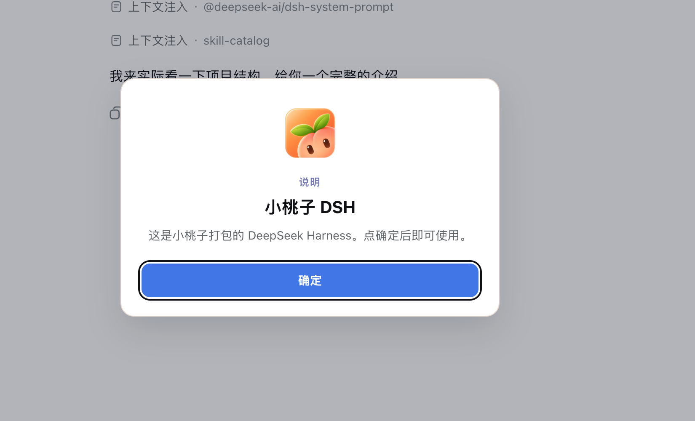

<h1 align="center">xiaotaozi-dsh</h1>

<p align="center">
  <a href="plugins/providers"></a>
  <a href="plugins/im"></a>
  <a href="plugins/xtz-ui"></a>
  <a href="plugins/sidebar"></a>
  <a href="plugins/market"></a>
</p>

<p align="center"><b>小桃子 DSH：用户产品是 xtz CLI，外加一套 DeepSeek Harness 插件。</b></p>

<p align="center">
  <b>dsh-providers</b> · <b>dsh-im</b> · <b>dsh-wecom-office</b> · <b>dsh-xtz-ui</b> · <b>dsh-sidebar</b> · <b>dsh-market</b>
</p>

<p align="center">
  设置 → <b>模型</b> · <b>小桃子</b> · <b>企业微信办公</b> · 侧栏 → <b>IM机器人</b> · <b>小桃子市场</b>
</p>

<p align="center">
  <a href="./README.md">English</a> ·
  <a href="./README.zh.md">中文</a> ·
  <a href="docs/conventions.zh.md">规范</a> ·
  <a href="docs/workflow.zh.md">流程</a> ·
  <a href="https://github.com/deepseek-ai/deepseek-harness">DeepSeek Harness</a>
</p>

<p align="center">
  <a href="https://github.com/kedoupi/xiaotaozi-dsh/stargazers"></a>
  <a href="https://github.com/kedoupi/xiaotaozi-dsh/issues"></a>
  <a href="LICENSE"></a>
  <a href="https://github.com/topics/dsh-plugin"></a>
  <a href="https://nodejs.org"></a>
  
</p>

[DeepSeek Harness](https://github.com/deepseek-ai/deepseek-harness) 从 Git 或 npm 装插件。本仓库是 **xiaotaozi-dsh**：用户产品是 [`apps/cli/`](apps/cli/) 的 `xtz` 命令；`plugins/` 是能力层。根目录不是插件，不要对它执行 `dsh plugin add`。

出了问题，或还缺某个插件？[提个 issue](https://github.com/kedoupi/xiaotaozi-dsh/issues)。

## 特性

- **用户入口只有 `xtz`。** 装 CLI，跑 `xtz start`，用浏览器打开官方 `dsh web`。第一次 `xtz start` 会种好默认插件。
- **一个包做一件事。** 自研插件在 `plugins/`，第一次 `xtz start` 全部种上。第三方是市场目录里的一行，用户装上游 Git/npm。不要把那些仓库 vendor 进本仓。
- **界面中文，默认英文文档。** 小桃子插件给用户看的文案是中文。对外 README 默认英文，中文在 `README.zh.md`。
- **两套家目录。** 测试走测试，正式走正式。改插件用 `.dsh-home`（`pnpm dev`，3081）。用户用 `xtz` 走 `~/.dsh`（3080）。不要混。
- **默认 Host，有 UI 再 mixed。** `pnpm new` 默认 host。只有设置页、Slot、主题才加 `src/client`。
- **Git 路径安装在用户机器上构建。** 每个插件把 `prepare` / `tsdown.config.ts` 留在包内，这样 `github:…#path:plugins/<slug>` 不必依赖整个 workspace 也能编过。

## `xtz` CLI

`xtz` 是用户产品。运行时精确固定为 Node.js `22.19.0` 和 DSH `0.1.1-rc.2`。用 npm、bun 或安装脚本装（它们只负责装包，运行仍是 Node）：

```bash
curl -fsSL https://raw.githubusercontent.com/kedoupi/xiaotaozi-dsh/main/apps/cli/scripts/install.sh | sh
npm install -g xiaotaozi-dsh-cli
bun add -g xiaotaozi-dsh-cli
xtz --help
xtz start
xtz doctor
dsh plugin --profile web add github:kedoupi/xiaotaozi-dsh#path:plugins/market
```

开放：帮助/版本、`start`/`web`、`stop`、`restart`、`open`、`status`、`config path`、`doctor`。`init`、`plugin`、`run`/`ask`、`config dump`/`defaults`、`update` 仍禁用。`start`/`stop` 只管理 `xtz` 自己拉起的进程；3080 被占用且不是 xtz 拉起的就拒绝。完整命令和安全边界见 [`apps/cli/README.zh.md`](apps/cli/README.zh.md)。

## 插件

| | 包 | 占用 | 做什么 |
| :-- | :-- | :-- | :-- |
|  | [`dsh-providers`](plugins/providers) | 设置 → **模型** | 官方订阅登录和 API Key 同一页，对话只显示勾选过的模型。[EN](plugins/providers/README.md) · [中文](plugins/providers/README.zh.md) |
|  | [`dsh-im`](plugins/im) | 侧栏「新会话」下方 → **IM机器人** | 九个聊天渠道和实验性 AI Office 连接器。企业微信**聊天**在这里；企业微信**办公**是 `dsh-wecom-office`。[EN](plugins/im/README.md) · [中文](plugins/im/README.zh.md) |
| | [`dsh-wecom-office`](plugins/wecom-office) | 设置 → **企业微信办公** | 通过官方 `wecom-cli` 接日程、文档、会议、通讯录、表格、待办、微盘。聊天仍走 `dsh-im`。和其它自研插件一起默认种上。[EN](plugins/wecom-office/README.md) · [中文](plugins/wecom-office/README.zh.md) |
|  | [`dsh-xtz-ui`](plugins/xtz-ui) | 设置 → **小桃子** | 品牌壳、归档、任务看板、Git 图谱，以及功能开关。[EN](plugins/xtz-ui/README.md) · [中文](plugins/xtz-ui/README.zh.md) |
|  | [`dsh-sidebar`](plugins/sidebar) | 设置 → **Side card** | 右侧文件 / 编辑器 / Git / 终端。[EN](plugins/sidebar/README.md) · [中文](plugins/sidebar/README.zh.md) |
|  | [`dsh-market`](plugins/market) | 侧边栏 → **小桃子市场**（新会话下方） | 列出第三方插件；这个 profile 已装的显示已安装，否则点安装。[EN](plugins/market/README.md) · [中文](plugins/market/README.zh.md) |

## 第三方（市场目录）

写在 `plugins/market` 的 `MARKET_PLUGINS`。用户在市场里点**安装**，或用下面的规格。不要把这些仓库 vendor 进本仓。规范：[docs/conventions.zh.md](docs/conventions.zh.md)「市场目录」。

| 插件 | 上游 | 安装规格 |
| :-- | :-- | :-- |
| Agent Teams | [NanmiCoder/dsh-agent-teams](https://github.com/NanmiCoder/dsh-agent-teams) | `github:NanmiCoder/dsh-agent-teams` |
| 会话上下文 | [bowenliang123/dsh-context](https://github.com/bowenliang123/dsh-context) | `github:bowenliang123/dsh-context` |
| OpenContext | [melandlabs/opencontext](https://github.com/melandlabs/opencontext) | `github:melandlabs/opencontext#path:plugins/dsh-opencontext` |

## 安装

选一个包装，不要装仓库根目录。

**先选安装模式。** 下面的 Git 路径命令是给 Node / 开发沙箱用的（`.dsh-home`、端口 3081）。不要把本仓库 `link:` 进正式 `~/.dsh` / 3080。额外用户安装走 `dsh plugin --profile web add`。

**第一步 — 把一个插件加到沙箱的 `web` profile。**

```bash
dsh plugin --profile web add github:kedoupi/xiaotaozi-dsh#path:plugins/providers
dsh web
```

**第二步 — 打开这个插件占用的页面或入口。** 模型：**设置 → 模型**；工作台：**设置 → 小桃子**；侧栏：**设置 → Side card**；IM：侧栏 **新会话** 下方 → **IM机器人**；企业微信办公：**设置 → 企业微信办公**；市场：侧栏 **新会话** 下方 → **小桃子市场**。欢迎弹框由工作台插件管理。

每个插件都是这种 Git 路径：

```text
github:kedoupi/xiaotaozi-dsh#path:plugins/<slug>
```

| 目录 | 安装路径 |
| :-- | :-- |
| `providers` | `github:kedoupi/xiaotaozi-dsh#path:plugins/providers` |
| `im` | `github:kedoupi/xiaotaozi-dsh#path:plugins/im` |
| `wecom-office` | `github:kedoupi/xiaotaozi-dsh#path:plugins/wecom-office` |
| `xtz-ui` | `github:kedoupi/xiaotaozi-dsh#path:plugins/xtz-ui` |
| `sidebar` | `github:kedoupi/xiaotaozi-dsh#path:plugins/sidebar` |
| `market` | `github:kedoupi/xiaotaozi-dsh#path:plugins/market` |

公开仓库请带 GitHub topic [`dsh-plugin`](https://github.com/topics/dsh-plugin)。改完源码要重新 `build`，并重启正在跑的 `dsh`。

## 用法

装好之后从对应页面用（模型 / 小桃子 / Side card / 企业微信办公走设置，IM 和市场走侧栏「新会话」下方，办公还可以在对话里用）。用户入口是 `xtz`；界面是官方 `dsh web` 开在浏览器里。

| 你想… | 安装 | 然后 |
| :-- | :-- | :-- |
| 登录 Codex / Claude / Grok / 通义灵码 / Kimi，或存 API Key | `dsh-providers` | 设置 → **模型** |
| 从飞书、微信、Slack 等跟本机 Harness 说话 | `dsh-im` | 侧栏「新会话」下方 → **IM机器人** |
| 让模型用企业微信日程、文档和会议 | `dsh-wecom-office` | 设置 → **企业微信办公**；`PATH` 上要有 `wecom-cli` |
| 浏览第三方插件 | `dsh-market` | 侧栏「新会话」下方 → **小桃子市场**；点 **安装** |
| 打开或关闭小桃子壳功能 | `dsh-xtz-ui` | 设置 → **小桃子** |
| 用右侧文件 / Git / 终端面板 | `dsh-sidebar` | 设置 → **Side card** |
| 多 Agent 带队干活 | 第三方 Agent Teams | 市场，然后 `dsh plugin --profile web add github:NanmiCoder/dsh-agent-teams` |
| 看模型窗口里现在有什么 | 第三方 dsh-context | 市场，然后 `dsh plugin --profile web add github:bowenliang123/dsh-context` |
| 长期记忆 / 召回 | 第三方 OpenContext | 市场，然后 `dsh plugin --profile web add github:melandlabs/opencontext#path:plugins/dsh-opencontext` |

## 截图

Web 打开时的欢迎弹框，点确定关掉。



设置 → 模型：左侧已接上的服务商，右侧登录或填密钥。


还没接上的服务商在「添加服务商」。


侧栏「新会话」下方 → IM机器人：扫码、贴 App Manifest，或填机器人凭据。


## 结构

```text
plugins/<slug>/     可发布的自研插件，包名 dsh-<slug>
apps/cli/           xtz CLI — 用户产品（独立、可发布的 pnpm workspace）
templates/          `pnpm new` 用的 host / mixed 模板
scripts/            new / link-plugin / 沙箱启动 / manifest / path-install / doctor
docs/               规范 + 步骤 + 文档地图
CONTRIBUTING.md     贡献入口：日常循环和门禁
apps/website/       独立的 VitePress 官网 workspace
.dsh-home/          gitignore 掉的沙箱 Harness 家目录（端口 3081）
```

根包不要声明 `dsh.bundle` 或 `dsh.profile`。
dsh RC、Node、Python、pnpm 和 CLI 版本只有一个机器可读规范源：[`versions.json`](versions.json)。各清单仍写普通字面值，不让 `package.json` 动态引用 JSON；`pnpm check` 负责拒绝漂移。

| | 正式 / 用户 | 沙箱 |
| :-- | :-- | :-- |
| 家目录 | `~/.dsh` | `<仓库>/.dsh-home`（gitignore） |
| 命令 | `xtz start` | `pnpm dev` |
| 端口 | **3080** | **3081** |
| 插件 | 第一次 `xtz start`（默认）；额外 `dsh plugin --profile web` | `link:` 到本仓库 |

| 要做什么 | 用哪套 |
| :-- | :-- |
| 改插件源码、设置页、`link-plugin` | 沙箱 **3081** |
| 用户产品（`xtz`） | 正式 `~/.dsh` **3080** |

`link-plugin` 和 `pnpm dev` 会把 `DSH_HOME` 设成 `.dsh-home`。不要把工作区插件挂到 `~/.dsh`。`pnpm check-home`（`node scripts/doctor.mjs`）只诊断并列出误挂项，绝不自动编辑 profile 或修复。

## 开发

贡献入口：[CONTRIBUTING.zh.md](CONTRIBUTING.zh.md)。规范：[docs/conventions.zh.md](docs/conventions.zh.md)。步骤：[docs/workflow.zh.md](docs/workflow.zh.md)。文档地图：[docs/README.zh.md](docs/README.zh.md)。硬性规则：[AGENTS.md](AGENTS.md)。和我一起开发时走 `/dsh-plugin`。

需要 Node.js `>= 22.19`，以及全局 CLI `@deepseek-ai/dsh@0.1.1-rc.2`（`@next`）。先克隆：

```bash
git clone https://github.com/kedoupi/xiaotaozi-dsh.git
cd xiaotaozi-dsh
pnpm install
```

克隆后先安装依赖，再运行任何构建或检查。

| 门禁 | 保证什么 |
| :-- | :-- |
| `pnpm check` | 版本/文档/清单策略、类型检查、插件测试和脚本测试；不证明已经生成 `lib/` |
| `pnpm check:build` | 构建全部插件，再强制检查生成的 `lib/`，保证 Git path 安装所需产物安全 |
| `pnpm check:path` | 按隔离的 Git `#path:` 形态安装每个插件并验证包内自构建 |
| `pnpm check:cli` | 独立安装、类型检查、构建并测试 `apps/cli`；不启动正式服务 |

```bash
pnpm new greet                 # 或：pnpm new sidebar --kind mixed
# 把 greet 样例换成真实逻辑，然后：
pnpm --filter dsh-greet test
pnpm --filter dsh-greet build
node scripts/link-plugin.mjs --profile dsh-dev greet
pnpm check-home   # 日常 ~/.dsh 不能挂本仓
```

要在 Web UI 里用：挂到沙箱的 `web`，再 `pnpm dev`（端口 3081）。改插件时不要对 `~/.dsh` 跑 `dsh web`。

```bash
node scripts/link-plugin.mjs --profile web <slug>
pnpm dev   # 只停验证为本仓启动的 :3081，再监视插件；未知监听者会拒绝启动
```

## 文档

先看哪份：[docs/README.zh.md](docs/README.zh.md)。

| 文档 | 什么时候看 |
| :-- | :-- |
| [参与贡献](CONTRIBUTING.zh.md) | 克隆、日常循环、门禁 |
| [规范](docs/conventions.zh.md) | 包身份、两套 home、Git（`main` + tag）、CLI 合同、版本、各项检查查什么 |
| [Changelog](CHANGELOG.md) | 产品快照（`vX.Y.Z`） |
| [流程](docs/workflow.zh.md) | 创建、安装、优化、提交、发布 |
| [AGENTS.md](AGENTS.md) | 本仓库给 agent 的硬性规则 |
| [dsh-providers](plugins/providers/README.zh.md) | 模型设置页 |
| [dsh-im](plugins/im/README.zh.md) | IM 机器人 |
| [dsh-wecom-office](plugins/wecom-office/README.zh.md) | 企业微信办公工具 |
| [dsh-market](plugins/market/README.zh.md) | 第三方目录和安装 |
| [dsh-xtz-ui](plugins/xtz-ui/README.zh.md) | 小桃子壳 |
| [dsh-sidebar](plugins/sidebar/README.zh.md) | 右侧文件 / Git / 终端 |

## License

[MIT](LICENSE)
