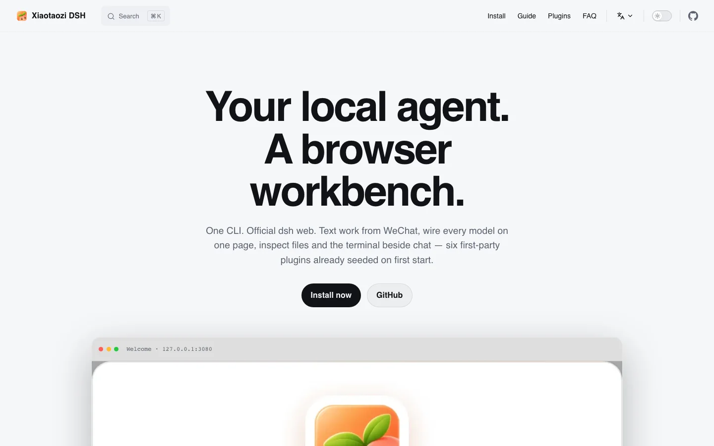

# 小桃子DSH 官网

小桃子DSH 的官方网站 [dsh.xiaotaozi.cc](https://dsh.xiaotaozi.cc)，基于 VitePress。英文是根语言，中文在 `/zh/` 下。本包是独立 pnpm workspace，不属于仓库根的 `plugins/*` workspace。

## 预览



## 本地开发

```bash
cd apps/website
pnpm install
pnpm dev      # 本地预览
pnpm build    # 静态产物在 .vitepress/dist
```

## 结构

```text
index.md            英文首页
guide/              快速开始 · 命令参考 · 插件 · 市场 · FAQ
zh/                 中文镜像（首页 + 指南）
public/             Logo、截图（拷贝自 plugins/*/docs）、站点预览图
.vitepress/         配置与蜜桃色主题覆盖
```

## 部署边界

托管：腾讯云 CloudBase 静态网站托管，环境 `xiaotaozi-5g279pi414331d52`（上海）。这个桶按顶层目录分站点，本站部署在 **`dsh/`** 目录（`pnpm deploy` 一步完成构建和上传；需先 `tcb login`）。文档工作不触发部署 —— 本地 `pnpm build` 验证即可。

域名 `dsh.xiaotaozi.cc`（控制台一次性配置）：

1. CloudBase 控制台 → 静态网站托管 → 设置 → 自定义域名 → 绑定 `dsh.xiaotaozi.cc`，并在 DNS 服务商处添加 CNAME 记录。
2. CDN 控制台 → 域名 `dsh.xiaotaozi.cc` → 回源配置 → 回源路径设为 `/dsh`，与桶里其他站点一致。

站点以 base `/` 构建，只有通过自定义域名（或回源路径为 `/dsh` 的域名）访问才能正常渲染，默认的 `tcloudbaseapp.com` 地址无法直接预览。

## 产品文档

产品语气、事实与截图规则见 [PRODUCT.md](PRODUCT.md)；视觉语言见 [DESIGN.md](DESIGN.md)。产品本身的文档在[根 README](../../README.zh.md)。

English: [README.md](README.md)。
