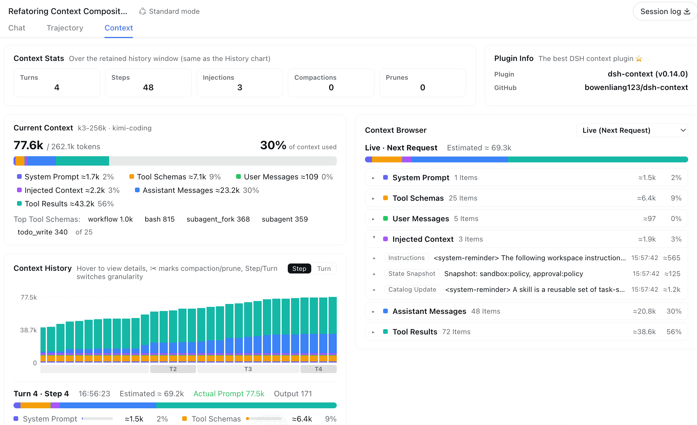
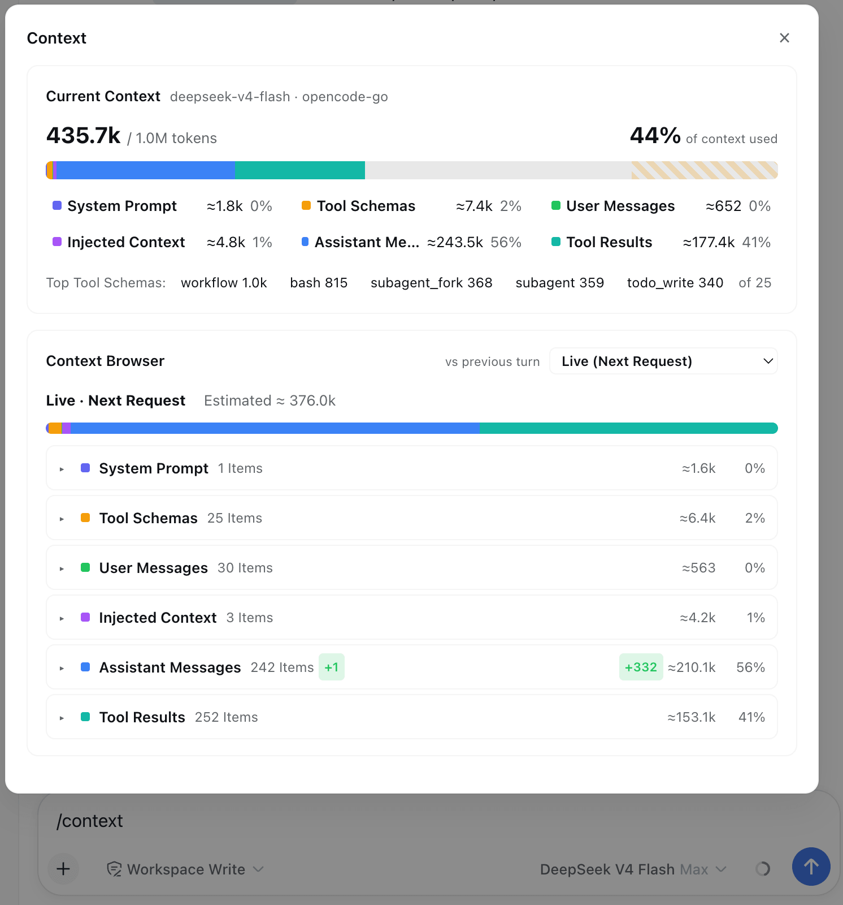

<p align="right"><a href="./README.md">English</a> · <strong>中文</strong></p>

<h1 align="center">dsh-context</h1>

<p align="center">
  
</p>

<p align="center"><b>会话「上下文」Tab 和 <code>/context</code>：组成、历史、事件。</b></p>

<p align="center">
  <a href="./README.md">English</a> ·
  <a href="./README.zh.md">中文</a> ·
  <a href="https://github.com/kedoupi/xiaotaozi-dsh">xiaotaozi-dsh</a> ·
  <a href="NOTICE">NOTICE</a>
</p>

<p align="center">
  <a href="./LICENSE"></a>
  <a href="https://github.com/topics/dsh-plugin"></a>
  
</p>

[DeepSeek Harness](https://github.com/deepseek-ai/deepseek-harness) 插件，源码来自 [bowenliang123/dsh-context](https://github.com/bowenliang123/dsh-context)（Apache-2.0）。会话 **上下文** Tab，加上 `/context`。

属于 [`xiaotaozi-dsh`](https://github.com/kedoupi/xiaotaozi-dsh)。不要对仓库根执行 `dsh plugin add`。不要和 npm 上的 `dsh-context` 装在同一个 profile。上游对照是 `externals/dsh-context`，不要装那个 checkout。

## 使用

### 上下文 Tab

这个 Tab 展示组成条、按请求的历史、事件，以及模型当前能看见的内容。



### `/context` 命令

输入 `/context` 或从斜杠菜单选择，在聊天中打开同一份洞察的居中弹层。它只在客户端工作，不会 dispatch 到 Host、不写 Session log，也不会新增模型可见历史。



## 特性

- **上下文 Tab。** 组成条、按请求的历史、事件，以及模型当前能看见的内容。
- **`/context`。** 不离开聊天，同一份洞察做成只在客户端打开的弹层；不会 dispatch 到 Host，不写 Session log，也不会新增模型可见历史。

现有截图：`docs/context-overview.png`、`docs/context-events.png`、`docs/context-command.png`.

## 安装

```bash
dsh plugin --profile web add github:kedoupi/xiaotaozi-dsh#path:plugins/context
dsh web
```

profile 里如果已有 npm 的 `dsh-context`，先卸掉。

## 开发

在 monorepo 根目录：

```bash
pnpm --filter dsh-context test
pnpm --filter dsh-context build
node scripts/link-plugin.mjs --profile web context
pnpm dev
```

挂的是仓库 `.dsh-home`（端口 3081），不是日常 `~/.dsh`。

## License

[Apache-2.0](LICENSE)。上游归属见 [NOTICE](NOTICE)。
