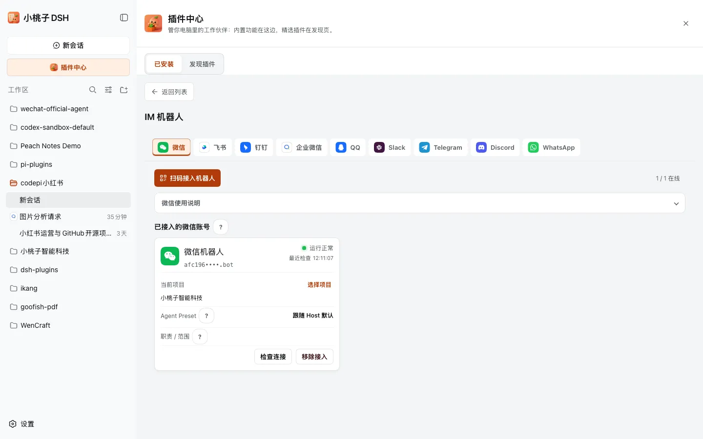
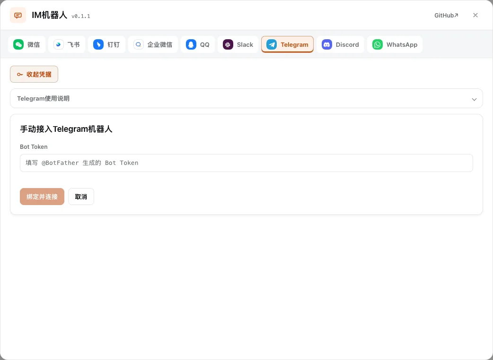

<p align="right"><a href="./README.md">English</a> · <strong>中文</strong></p>

<h1 align="center">dsh-im</h1>

<p align="center">
  
</p>

<p align="center"><b>侧栏「新会话」下方 → IM机器人：把本机 Harness 接到聊天软件。</b></p>

<p align="center">
  飞书 · 微信 · 钉钉 · 企业微信 · QQ · Slack · Telegram · Discord · WhatsApp · AI Office
</p>

<p align="center">
  <a href="./README.md">English</a> ·
  <a href="./README.zh.md">中文</a> ·
  <a href="https://github.com/kedoupi/xiaotaozi-dsh">xiaotaozi-dsh</a> ·
  <a href="THIRD_PARTY_NOTICES.md">THIRD_PARTY_NOTICES.md</a>
</p>

<p align="center">
  <a href="../../LICENSE"></a>
  <a href="https://github.com/topics/dsh-plugin"></a>
  
</p>

[DeepSeek Harness](https://github.com/deepseek-ai/deepseek-harness) 插件。扫码、App Manifest 或已有凭据即可接入。每个渠道可以挂多个机器人。Secret 只进 Host 凭据存储。

渠道运行时在 `src/channels/`，Cordis RPC 在 `src/host/`，界面在 `src/client/`。

属于 [`xiaotaozi-dsh`](https://github.com/kedoupi/xiaotaozi-dsh) monorepo。界面文案跟随 Harness 语言（中文 / English）。渠道适配来自 [xmanrui/dsh-im](https://github.com/xmanrui/dsh-im)（MIT）。第三方说明见 [THIRD_PARTY_NOTICES.md](THIRD_PARTY_NOTICES.md)。不要对仓库根目录执行 `dsh plugin add`。

## 能做什么

- **九个聊天渠道，外加实验性 AI Office。** 按产品用扫码、App Manifest 或已有密钥。
- **每个渠道可以挂多个机器人。** Secret 不会进客户端包。
- **文件可以双向走。** 聊天文件进入当前会话工作区；结果文件用渠道原生附件回传。
- **连接中就能选择项目。** 机器人还没完全上线也可以选择 Web 中已创建的项目。
- **对话里可用命令。** 不离开聊天就能切换项目、会话、模型和预设。
- **每个机器人可单独选 Agent Preset 和职责。** 每只机器人有自己的工具箱和一段范围说明。
- **企微办公就在机器人卡片上。** 日程、文档、会议按企业微信机器人开通，没有单独的办公页面。

## 快速开始

```bash
dsh plugin --profile web add github:kedoupi/xiaotaozi-dsh#path:plugins/im
dsh web
```

然后打开侧栏 **新会话** 下方的 **IM机器人**（若装了小桃子市场，则在市场按钮下面）。改源码时让沙箱 `pnpm dev` 一直跑；`lib/index.js` 变了它会自己重启 Host。

## 功能截图

| 渠道总览 | 无凭据的接入流程 |
| :-- | :-- |
|  |  |

## 渠道

| 渠道 | 接入 |
| :-- | :-- |
| 飞书 | 扫码或 App ID + Secret；流式卡片；群聊 @/全量响应；会话关注与归档 |
| 微信 | 扫码（腾讯 iLink） |
| 钉钉 | 扫码或 Client ID + Secret；AI Card |
| 企业微信 | 扫码或 Bot ID + Secret；机器人卡片上有「办公能力」区 |
| QQ | 扫码或 AppID + AppSecret；最终回答支持 Markdown，私聊进度收在一个气泡里 |
| Slack | App Manifest + Bot/App Token |
| Telegram | BotFather Token；可选私聊白名单；原生 Rich Message（私聊 Draft，群聊/Topic 原位更新） |
| Discord | Bot Token。需启用 **Message Content Intent**。服务器文字/公告频道 @ 机器人后会开 Public Thread；权限需要 **Create Public Threads**、**Send Messages in Threads**、**Send Messages**、**Read Message History**。发结果文件还要 **Attach Files**。 |
| WhatsApp | 关联设备扫码（非官方 WhatsApp Web；请用专用号码）。默认仅自己；也可按机器人改成指定联系人或开放响应 |
| AI Office | 本机向外心跳 + SSE；实验功能，需 `officeEnabled: true` |

## 项目与会话

- **只能选择已有项目。** 选择器只列当前 Web 项目，不会替你新建。新机器人取消后仍保持待选择，入站工作不会回退到仓库目录。企业微信选择项目不跟鉴权绑死。飞书开通失败保持失败（重试提示有翻译），不会一直转圈。
- **对话里可用命令。** `/help` `/new` `/status` `/models` `/model` `/presetlist` `/preset` `/stop` `/steer` `/compact` `/workspace` `/workspacelist` `/sessionlist` `/session`。`/workspacelist` 列出 Web 项目；`/workspace` 按列表序号或唯一项目名切换。
- **每个机器人可单独选 Agent Preset。** 在 IM 面板或发 `/preset` 切换；只影响之后新建的会话，当前聊天要先 `/new`。
- **每个机器人可写职责 / 范围。** 页卡上一段短文本，每次入站对话都会带上。项目 `AGENTS.md` 仍共用；换工具箱继续用 Agent Preset。
- **企微审批后另发一条。** 审批或追问之后，最终回答是**新消息**。改原来的思考流，企业微信侧不会显示。
- **工具回合失败。** 会话里 `tool_calls` 不完整时，会提示 `/stop` 再开新会话，而不是一句「原因不明」。`/new` 救不了 Harness 工具调度器空指针（`reading 'prepare'`）；见产品 FAQ。

## 文件与结果

聊天里的普通文件（不只是图片）会进入当前 Harness 会话，展示为「已上传文件」加工作区路径，不是 JSON 原文。结果文件和图片用 `dsh_im_return_file` 以渠道原生附件回传。Slack 应用除了 `files:read` 还要有 `files:write`。

## 企业微信办公边界

企业微信**聊天**是本插件；企业微信**办公**（日程、文档、会议）是 [`dsh-wecom-office`](../wecom-office)，在每张企业微信机器人卡片上开通和管理。装了 `dsh-wecom-office` 后，每张企业微信机器人卡片有「办公能力」区：开通办公、显式切换办公机器人、管理「允许修改」开关。办公机器人同时只有一只，不跟随消息来自哪只 bot。没有独立的办公设置页。

## 数据与稳定性

- Secret 只进 Host 凭据存储，不会进客户端包。
- Config 默认 `rpcAuthority=loopback`、隔离各渠道故障、回复超时 600000ms、连接超时 20000ms。QQ、WhatsApp、Office 按需加载；`agentPreset` 可指定默认预设。
- **机器人英文文案。** Host 配置 `language: en` 或环境变量 `DSH_IM_LANGUAGE=en` 后，提示和命令帮助切英文；未收录的句子仍按中文发出。

## 开发

AI Office 默认关闭。按 profile 在 `Config` 里设 `officeEnabled: true`（或 `office.enabled: true`）才启用；启用后该渠道还要单独配好自己的连接凭据。

在 monorepo 根目录：

```bash
pnpm --filter dsh-im test
pnpm --filter dsh-im build
node scripts/link-plugin.mjs --profile web im
pnpm dev
```

## 文档

| 文档 | 什么时候看 |
| :-- | :-- |
| [THIRD_PARTY_NOTICES.md](THIRD_PARTY_NOTICES.md) | 上游 MIT 归属 |
| [dsh-wecom-office](../wecom-office/README.zh.md) | 企业微信日程、文档、会议（在机器人卡片上管理） |
| [流程](../../docs/workflow.zh.md) | 创建、安装、优化、提交 |
| [规范](../../docs/conventions.zh.md) | 包身份、两套 home |
| [xiaotaozi-dsh](../../README.zh.md) | 整个 monorepo |

## License

[MIT](../../LICENSE)
