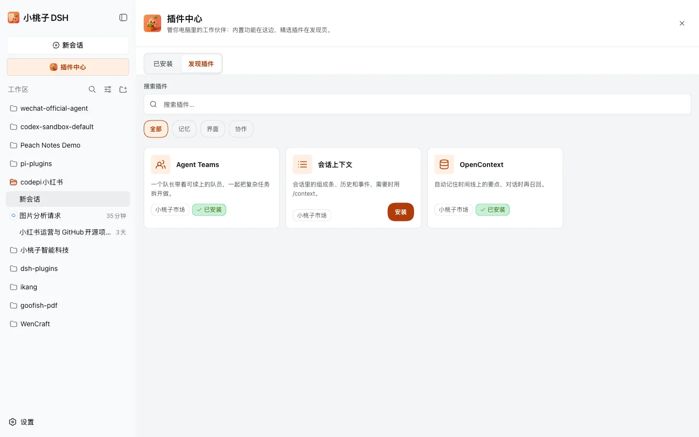
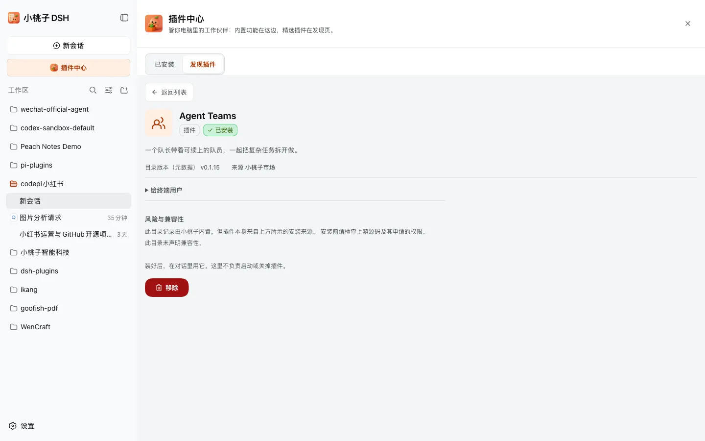

<p align="right"><strong>English</strong> · <a href="./README.zh.md">中文</a></p>

<h1 align="center">dsh-market</h1>

<p align="center">
  
</p>

<p align="center"><b>Xiaotaozi DSH market: third-party plugins from the catalog, install into this profile</b></p>

<p align="center">
  <a href="./README.md">English</a> ·
  <a href="./README.zh.md">中文</a> ·
  <a href="https://github.com/kedoupi/xiaotaozi-dsh">xiaotaozi-dsh</a>
</p>

<p align="center">
  <a href="../../LICENSE"></a>
  <a href="https://github.com/topics/dsh-plugin"></a>
</p>

Part of the [`xiaotaozi-dsh`](https://github.com/kedoupi/xiaotaozi-dsh) monorepo. Do not `dsh plugin add` the repository root.

## What it unlocks

- A first-class sidebar entry below **New Session** that opens the market overlay.
- A curated catalog of third-party plugins with search, tag filters, and per-plugin details.
- One-click install into the current profile, with an honest installed/not-installed state per card.

## Open the Market

Click **小桃子市场** in the sidebar tools row (market left, IM right), directly below **New Session**. The overlay opens over the current conversation; close it with the × button or by clicking the backdrop.

## Market vs. Settings → Plugins

The Market discovers, installs, and removes optional third-party plugins. It does not replace **Settings → Plugins**: **Plugin configuration** is the only UI for built-in Terminal, Agent Loop, and Web Search settings, while **Plugin list** is the Host's runtime inventory and status view, including built-in and first-party plugins.

## See it





## Catalog and details

The catalog is `MARKET_PLUGINS` — three curated rows today:

| Plugin | What it is |
| :-- | :-- |
| Agent Teams | Multi-agent collaboration with a captain and resumable members (NanmiCoder) |
| session Context (会话上下文) | Composition bar, history, events, and `/context` (bowenliang123) |
| OpenContext | Temporal memory graph with automatic recall (melandlabs) |

Search matches name, summary, and tags; tag chips filter the grid. **View details** opens a detail view with the summary, version, source, and the exact install specification.

First-party packages under `plugins/` are seeded on start and are not sold here.

## Installation state

A card shows **Installed** when the package is already a dependency of the current profile's `package.json`; otherwise it shows **Install**. The state is profile-specific: installing into the `web` profile does not mark the plugin installed in another profile.

Clicking **Install** runs `dsh plugin --profile web add` with the exact pinned DSH runtime that booted the current Host, against the current `DSH_HOME` (official `~/.dsh` or sandbox `.dsh-home`). A PATH `dsh` is never used, and the market never installs from `#path:externals/…`.

## Sources and boundaries

| Field | Default | Meaning |
| :-- | :-- | :-- |
| `indexUrl` | `https://s.xiaotaozi.cc/dsh/packs/market.json` | Configured official index URL / source identity; not fetched here |
| `officialLabel` | `小桃子市场` | Display name of the official source |
| `allowThirdPartySources` | `true` | Reserved switch; remote source catalogs are not implemented, so this build still disables adding them |

Existing source records remain in `$DSH_HOME/plugins/market/sources.json` and can be removed in the panel. New source records are rejected with an explicit “not supported” response until remote fetch, signature, and cache contracts exist.

## Install

```bash
dsh plugin --profile <name> add github:kedoupi/xiaotaozi-dsh#path:plugins/market
```

## Documentation

| Doc | Read it when |
| :-- | :-- |
| [Workflow](../../docs/workflow.md) | Create, install, simplify, commit |
| [Conventions](../../docs/conventions.md) | Package identity and two homes |

## License

[MIT](../../LICENSE)
