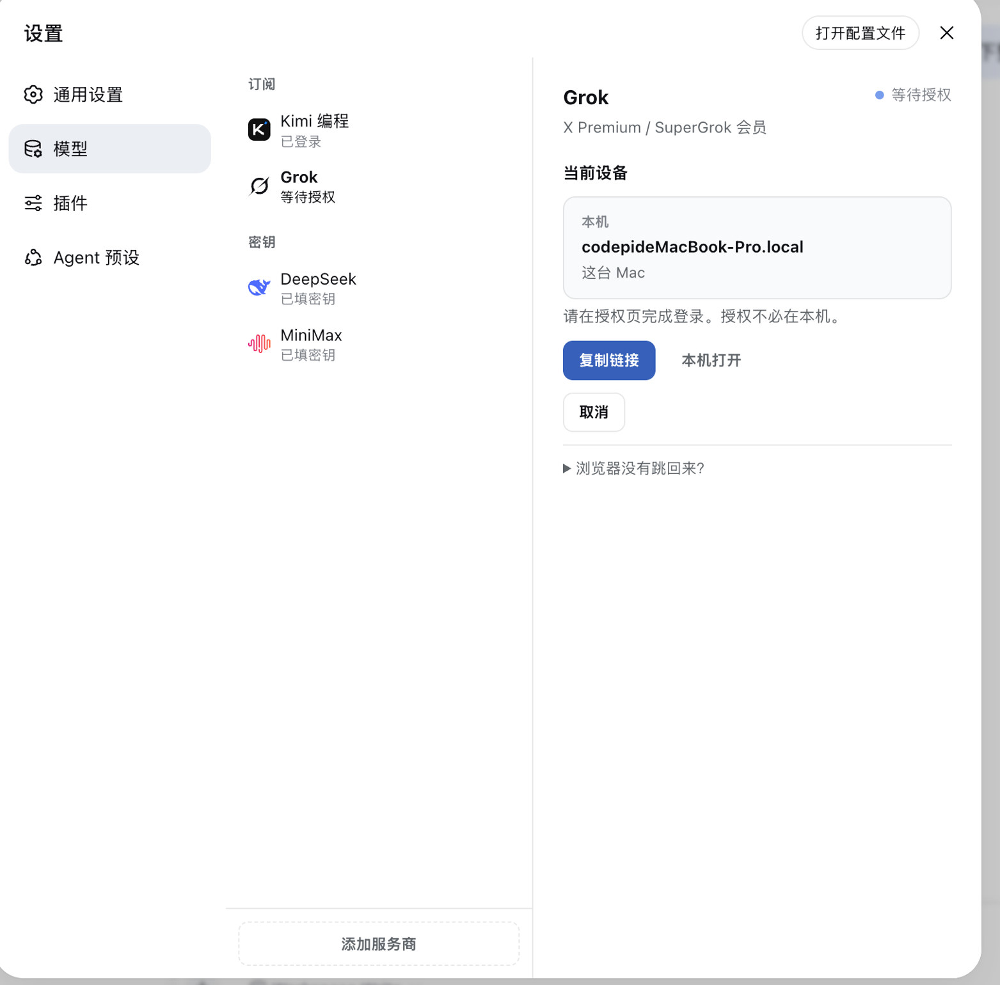
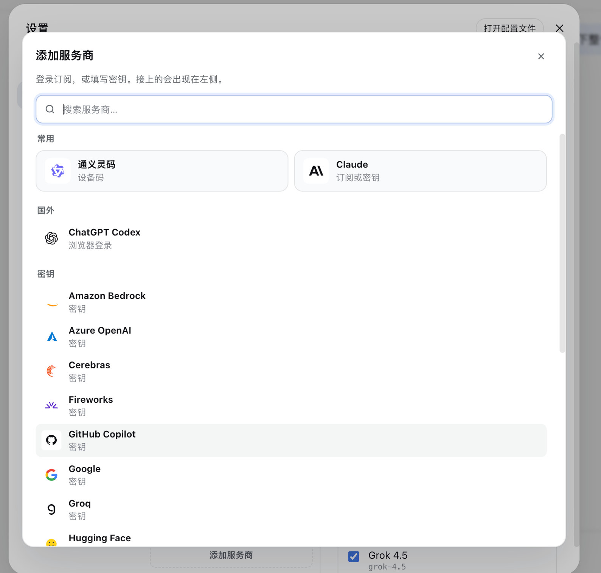

<p align="right"><strong>English</strong> · <a href="./README.zh.md">中文</a></p>

<h1 align="center">dsh-providers</h1>

<p align="center">
  
</p>

<p align="center"><b>Settings → Models: official memberships and API keys on one page.</b></p>

<p align="center">
  Codex · Claude · Grok · Qwen · Kimi · custom OpenAI-compatible endpoints
</p>

<p align="center">
  <a href="./README.md">English</a> ·
  <a href="./README.zh.md">中文</a> ·
  <a href="https://github.com/kedoupi/xiaotaozi-dsh">xiaotaozi-dsh</a> ·
  <a href="PRODUCT.md">PRODUCT.md</a>
</p>

<p align="center">
  <a href="../../LICENSE"></a>
  <a href="https://github.com/topics/dsh-plugin"></a>
  
</p>

A [DeepSeek Harness](https://github.com/deepseek-ai/deepseek-harness) plugin. The sidebar lists connected vendors; the right pane signs in or stores a key, then you check which models appear in the conversation picker. Unconnected vendors live behind **Add provider**. The host Models page is unused on purpose.

Part of the [`xiaotaozi-dsh`](https://github.com/kedoupi/xiaotaozi-dsh) monorepo. User-facing copy in the Web UI is Chinese. Auth flows take after [dsh-plugin-subscriptions](https://github.com/V1ki/dsh-plugin-subscriptions) (MIT). Do not `dsh plugin add` the repository root.

## Features

- **Membership and keys on one page.** OAuth / device code for official products; API keys for the rest; custom OpenAI-compatible endpoints.
- **Chat only lists what you checked.** Selection applies immediately.
- **Authorization can finish on another device.** The page shows this computer, the link, and the device code.
- **`image_generate`.** After ChatGPT or Grok is signed in, the model can generate pictures. ChatGPT uses `gpt-image-2`; Grok uses `grok-imagine-image-2.0`. The `provider` argument picks the preferred backend (`gpt` by default); the other is used when that one is signed out. Images are saved under `$DSH_HOME/plugins/providers/images/` and shown inline. Claude, Qwen Code, and Kimi Code subscriptions have no image-generation API, so they are not wired.
- **`video_generate`.** After Grok is signed in, the model can generate a 1–15s clip with `grok-imagine-video-1.5`. MP4s are saved under `$DSH_HOME/plugins/providers/videos/` and play inline. Optional `image_url` is image-to-video. ChatGPT, Claude, Qwen Code, and Kimi Code have no video-generation API on these logins.

## Install

```bash
dsh plugin --profile web add github:kedoupi/xiaotaozi-dsh#path:plugins/providers
dsh web
```

Then open **Settings → Models**. After source changes: rebuild this package and restart `dsh`.

## Screenshots





## Subscriptions

| Product | Sign-in |
| :-- | :-- |
| ChatGPT Codex | OAuth (Plus / Pro) |
| Claude | OAuth (Pro / Max) |
| Grok | OAuth (X Premium) |
| Qwen Code | Device code |
| Kimi Code | Device code (official Kimi Code) |
| Zhipu GLM, Doubao, MiniMax, iFlytek Spark, Hunyuan | Listed under Add provider; official membership login is not wired yet |

## API keys and custom endpoints

Built-in API vendors use the host credential store. Saved keys are shown as a mask, never as plaintext.

A key that arrives from the **launch environment** is read-only here. The page explains that; it will not replace or unset it. Change it where you start `dsh`.

Custom vendors are OpenAI-compatible endpoints (`name`, `base URL`, `key`). Models are loaded from the endpoint, not typed in by hand.

## Data

Membership tokens: `$DSH_HOME/plugins/providers/auth.json` (mode `0600`). Files left under `plugins/passport/` from the old package name are copied on first load. Generated images: `$DSH_HOME/plugins/providers/images/`. Generated videos: `$DSH_HOME/plugins/providers/videos/`.

API keys go through the host credentials seam (`$DSH_HOME/.credentials.yaml`), unless the process environment already supplies that reference.

## Develop

From the monorepo root:

```bash
pnpm --filter dsh-providers test
pnpm --filter dsh-providers build
node scripts/link-plugin.mjs --profile web providers
pnpm dev
```

That links into the repo `.dsh-home` (port 3081), not the daily `~/.dsh`.

## Documentation

| Doc | Read it when |
| :-- | :-- |
| [PRODUCT.md](PRODUCT.md) | Product notes |
| [Workflow](../../docs/workflow.md) | Create, install, simplify, commit |
| [Conventions](../../docs/conventions.md) | Package identity and two homes |
| [xiaotaozi-dsh](../../README.md) | The rest of the monorepo |

## License

[MIT](../../LICENSE)
