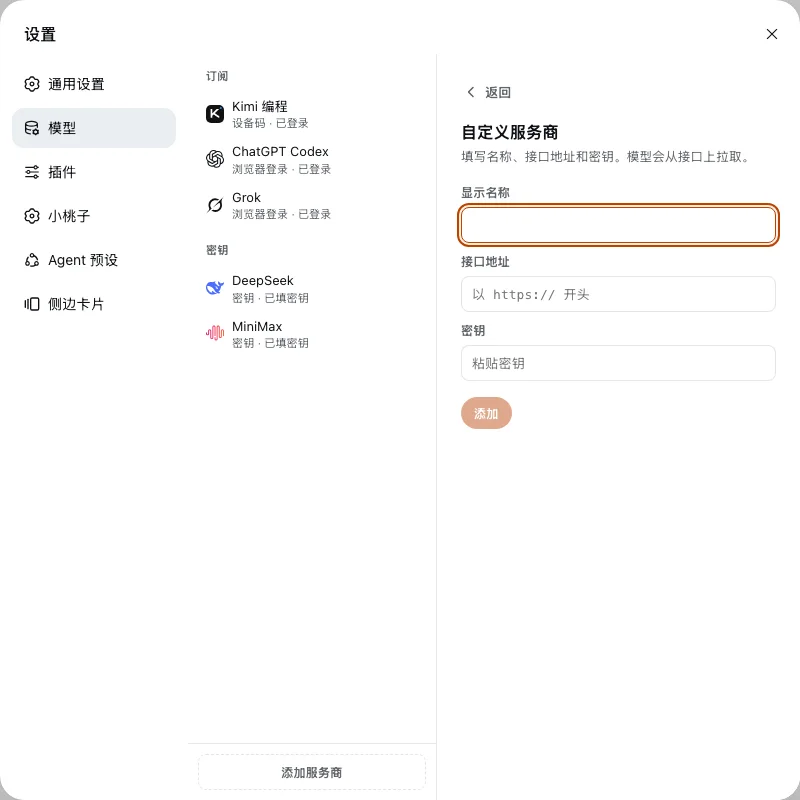

<p align="right"><a href="./README.md">English</a> · <strong>中文</strong></p>

<h1 align="center">dsh-providers</h1>

<p align="center">
  
</p>

<p align="center"><b>设置 → 模型：官方订阅和 API Key 放在同一页。</b></p>

<p align="center">
  Codex · Claude · Grok · 通义灵码 · Kimi · 自定义 OpenAI 兼容接口
</p>

<p align="center">
  <a href="./README.md">English</a> ·
  <a href="./README.zh.md">中文</a> ·
  <a href="https://github.com/kedoupi/xiaotaozi-dsh">xiaotaozi-dsh</a> ·
  <a href="PRODUCT.md">PRODUCT.md</a>
</p>

<p align="center">
  <a href="../../LICENSE"></a>
  <a href="https://github.com/topics/dsh-plugin"></a>
  
</p>

[DeepSeek Harness](https://github.com/deepseek-ai/deepseek-harness) 插件。左侧只列出已接上的服务商，右侧登录或填密钥，并勾选对话框里要用的模型。没接上的在「添加服务商」。官方 Models 页故意不用。界面文案只有中文。

## 能做什么

- **订阅和密钥同一页。** 官方产品走 OAuth / 设备码，其余走 API Key，还可以加 OpenAI 兼容自定义接口。
- **对话只显示勾选过的模型。** 勾选立刻生效。
- **授权可以在另一台设备完成。** 页面会显示本机、授权链接和设备码。
- **对话里生成图片和视频。** 登录 ChatGPT 或 Grok 后解锁 `image_generate` 和 `video_generate`（见下文）。

## 快速开始

```bash
dsh plugin --profile web add github:kedoupi/xiaotaozi-dsh#path:plugins/providers
dsh web
```

然后打开 **设置 → 模型**。改完源码要重新构建这个包，并重启 `dsh`。

## 功能截图




## 订阅与密钥

| 产品 | 登录 |
| :-- | :-- |
| ChatGPT Codex | OAuth（Plus / Pro） |
| Claude | OAuth（Pro / Max） |
| Grok | OAuth（X Premium） |
| 通义灵码 | 设备码 |
| Kimi 编程 | 设备码（官方 Kimi Code） |
| 智谱 GLM、豆包、MiniMax、讯飞星火、腾讯混元 | 添加服务商里已列出，官方会员授权接入中 |

内置 API 服务商走 host 的凭证存储。已保存的密钥只显示星号，不会明文出现。

**启动环境**里带来的密钥在这里是只读的。页面会说明这一点，不会更换或清除。要改请在启动 `dsh` 的环境里处理。

自定义服务商是 OpenAI 兼容接口（名称、地址、密钥）。模型从接口拉取，不用手填模型名。

## 图片和视频生成

- **`image_generate`。** 登录 ChatGPT 或 Grok 后，对话里可以出图。ChatGPT 走 `gpt-image-2`，Grok 走 `grok-imagine-image-2.0`。`provider` 参数选择优先后端（默认 `gpt`），没登录时自动用另一个。图片保存在 `$DSH_HOME/plugins/providers/images/`，并在对话里内联显示。Claude、通义灵码、Kimi 编程的订阅接口没有图片生成，因此不接入。
- **`video_generate`。** 登录 Grok 后，对话里可以出 1–15 秒短片（`grok-imagine-video-1.5`）。MP4 保存在 `$DSH_HOME/plugins/providers/videos/`，并在对话里内联播放。可选 `image_url` 做图生视频。ChatGPT、Claude、通义灵码、Kimi 编程的订阅接口没有视频生成，因此不接入。

## 数据与隐私

订阅令牌：`$DSH_HOME/plugins/providers/auth.json`（权限 `0600`）。旧包名留下的 `plugins/passport/` 会在首次加载时拷过来。生成的图片：`$DSH_HOME/plugins/providers/images/`。生成的视频：`$DSH_HOME/plugins/providers/videos/`。

API 密钥走 host 凭证（`$DSH_HOME/.credentials.yaml`）；若进程环境已经提供同名变量，则以环境为准。

## 开发

在 monorepo 根目录：

```bash
pnpm --filter dsh-providers test
pnpm --filter dsh-providers build
node scripts/link-plugin.mjs --profile web providers
pnpm dev
```

挂的是仓库 `.dsh-home`（端口 3081），不是日常 `~/.dsh`。

## 文档

| 文档 | 什么时候看 |
| :-- | :-- |
| [PRODUCT.md](PRODUCT.md) | 产品说明 |
| [流程](../../docs/workflow.zh.md) | 创建、安装、优化、提交 |
| [规范](../../docs/conventions.zh.md) | 包身份、两套 home |
| [xiaotaozi-dsh](../../README.zh.md) | 整个 monorepo |

## License

[MIT](../../LICENSE)
