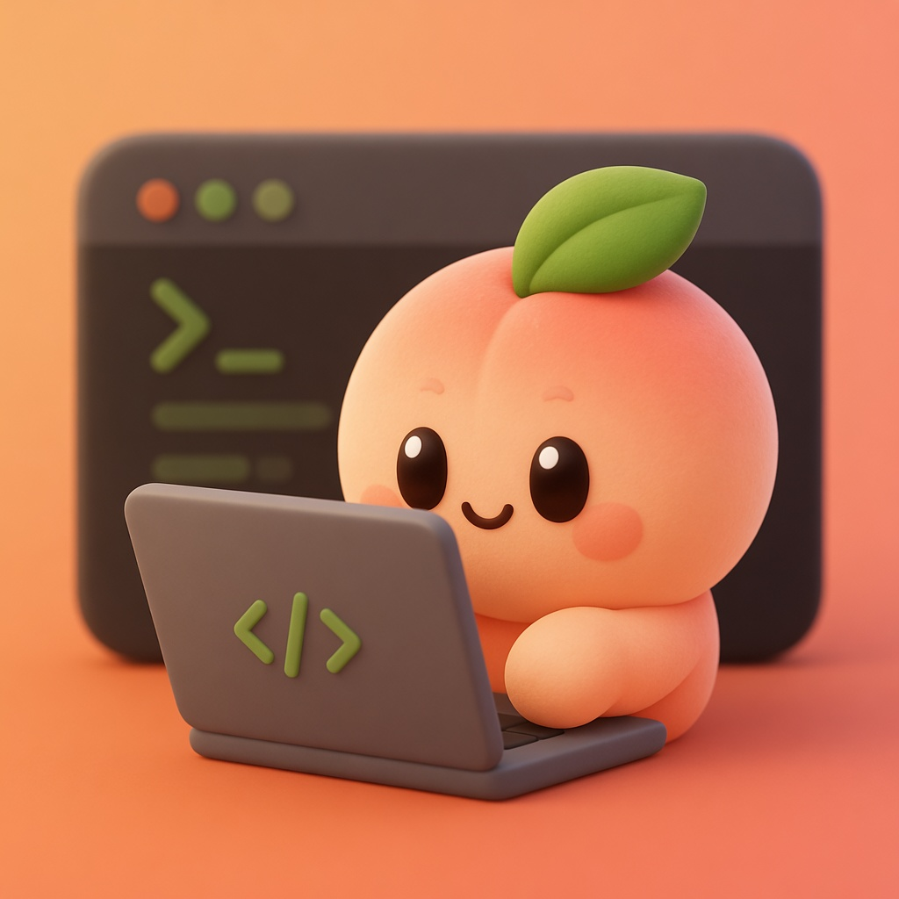
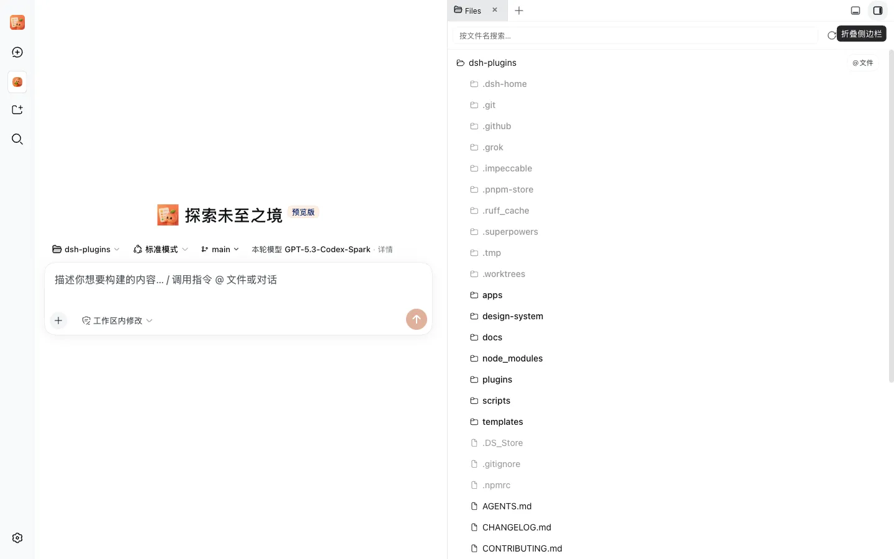

<p align="right"><strong>English</strong> · <a href="./README.zh.md">中文</a></p>

<h1 align="center">dsh-sidebar</h1>

<p align="center">
  
</p>

<p align="center"><b>Right workbench: files, editor, Git, terminal, and Settings → Side card.</b></p>

<p align="center">
  <a href="./README.md">English</a> ·
  <a href="./README.zh.md">中文</a> ·
  <a href="https://github.com/kedoupi/xiaotaozi-dsh">xiaotaozi-dsh</a>
</p>

<p align="center">
  <a href="../../LICENSE"></a>
  <a href="https://github.com/topics/dsh-plugin"></a>
  
</p>

Right-hand workbench for [DeepSeek Harness](https://github.com/deepseek-ai/deepseek-harness). Explorer, CodeMirror editor, Git, xterm + node-pty terminal, and **Settings → Side card**. Session-scoped `/sidebar` API. External links open in the system browser.

Adapted from [DSH-better-sidebar](https://github.com/omdsh-dev/DSH-better-sidebar) (MIT). See [NOTICE](NOTICE) and [DSH-better-sidebar.LICENSE](DSH-better-sidebar.LICENSE). Do not install the author's npm next to this package.

Xiaotaozi chrome (brand, archive, task board, git graph) stays in [`dsh-xtz-ui`](../xtz-ui). Models, IM, WeCom office, and market stay in those plugins.

Part of the [`xiaotaozi-dsh`](https://github.com/kedoupi/xiaotaozi-dsh) monorepo. Do not `dsh plugin add` the repository root.

## What it unlocks

- A right-hand workbench beside the conversation: a workspace file explorer, a CodeMirror editor, source control, and a real terminal, all in one tab strip.
- Everything is scoped to the current session through the session-scoped `/sidebar` API — each session's panel points at that session's workspace.
- **Settings → Side card** decides which tabs mount; uninstalling the plugin removes the whole panel.

## Quick start

```bash
dsh plugin --profile web add github:kedoupi/xiaotaozi-dsh#path:plugins/sidebar
dsh web
```

Select a session, then open the workbench with the panel toggle in the top-right corner. Open **Settings → Side card** to choose which tabs mount. Uninstall this plugin to remove the right panel entirely.

## See it

One pass through the workbench: open the panel beside a conversation, browse the workspace in the file tree and open a Markdown note in the editor's rendered preview, review and commit the change in source control, then run a command in the terminal — all scoped to the session's workspace.



## Files and editor

- Lazy VSCode-style file tree rooted at the session workspace, with filename search and drag-and-drop upload into any folder; dotfiles are always listed, shown dimmed.
- Every tree row can copy its relative or absolute path from the context menu.
- CodeMirror editor with tabs and split panes; Markdown files toggle between editing and a rendered preview (Mermaid diagrams included), and PDFs open in their own viewer.
- "Open with" sends a file to your configured editors, with VSCode-family SSH remote support when an SSH target is set.

## Git

- Source-control panel with staged vs. unstaged status, stage/unstage, and a commit message box.
- Branch switching plus a VSCode-like history: branch decorations, author, and relative time per row.
- Clicking a changed file or a history row opens a dedicated diff tab.
- Right-click a changed file for advanced operations (open in editor, discard); destructive actions ask for confirmation first.

## Terminal

- A real terminal — xterm in the page, node-pty on the host — running your default shell in the session workspace.
- A dropped connection reconnects automatically; a shell that exited says so instead of swallowing input.
- If node-pty fails to load, the panel shows the exact repair command and a retry button.

## Side card settings

**Settings → Side card** lists each workbench feature as a card; toggle a card to mount or unmount that tab. Secondary settings sit on the feature's own popup: file-open behavior, editor "open with" apps, terminal options, and more.

## Security and boundaries

- Every workbench request goes through the session-scoped `/sidebar` API carrying the session id; filesystem paths resolve through symlink-aware guards that reject anything outside the session workspace.
- External http(s) links open in the system browser by default; a plugin tab whose URL target matches can take a link over when the link-interception preferences allow it.
- HTML files preview in an opaque-origin sandboxed iframe that cannot read session data (the default; a warned setting can relax it). Markdown preview is sanitized and rendered in-page, never injected as raw HTML.
- Destructive Git operations (discard, revert, cherry-pick) are gated by a confirm dialog.
- The editor and terminal surfaces follow the app's own light/dark theme tokens; Xiaotaozi chrome (brand, archive, task board, Git graph) lives in [`dsh-xtz-ui`](../xtz-ui), not here.

## Develop

From the monorepo root:

```bash
pnpm --filter dsh-sidebar test
pnpm --filter dsh-sidebar build
node scripts/link-plugin.mjs --profile web sidebar
pnpm dev
```

That links into the repo `.dsh-home` (port 3081), not the daily `~/.dsh`.

## Documentation

| Doc | Read it when |
| :-- | :-- |
| [NOTICE](NOTICE) | Upstream MIT attribution |
| [Workflow](../../docs/workflow.md) | Create, install, simplify, commit |
| [Conventions](../../docs/conventions.md) | Package identity and two homes |
| [xiaotaozi-dsh](../../README.md) | The rest of the monorepo |

## License

[MIT](../../LICENSE)
