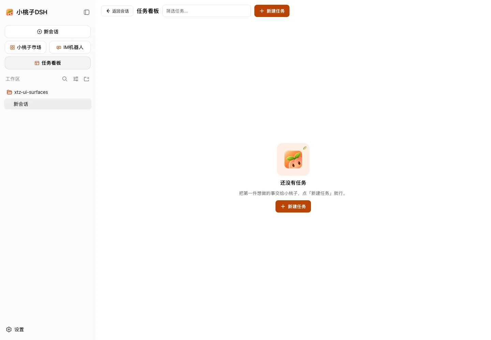
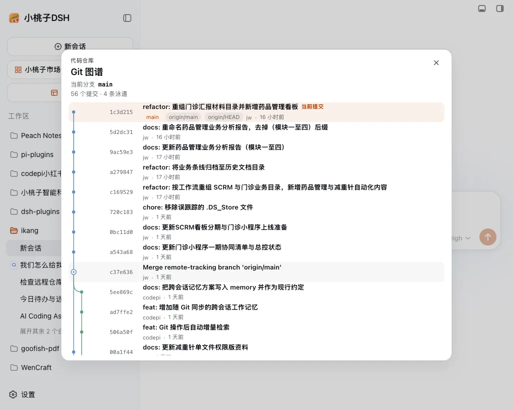

<p align="right"><strong>English</strong> · <a href="./README.zh.md">中文</a></p>

<h1 align="center">dsh-xtz-ui</h1>

<p align="center">
  
</p>

<p align="center"><b>Xiaotaozi DSH chrome: brand, welcome notice, and Settings → Xiaotaozi toggles.</b></p>

<p align="center">
  <a href="./README.md">English</a> ·
  <a href="./README.zh.md">中文</a> ·
  <a href="https://github.com/kedoupi/xiaotaozi-dsh">xiaotaozi-dsh</a>
</p>

<p align="center">
  <a href="../../LICENSE"></a>
  <a href="https://github.com/topics/dsh-plugin"></a>
  
</p>

Xiaotaozi UI plugin for [Xiaotaozi DSH](https://xiaotaozi.cc/). It owns brand chrome, the welcome notice, **Settings → Xiaotaozi**, archive, task board, and git graph. Each of those can be turned on or off without restarting. The right-hand files / Git / terminal panel is [`dsh-sidebar`](../sidebar). Models, IM, WeCom office, and market stay in those plugins.

Part of the [`xiaotaozi-dsh`](https://github.com/kedoupi/xiaotaozi-dsh) monorepo. Do not `dsh plugin add` the repository root.

## What it unlocks

- **Settings → Xiaotaozi** with independent switches for archive, task board, Git graph, and “announce to agent”.
- **Task board** in the center column, with optional cron runs that keep firing after the browser closes.
- **Git graph**: a branch chip on a blank session that opens a commit graph with SVG lanes, merge curves, and ref badges.
- **Archive** management for hidden conversations: search, preview, restore, or permanently delete.
- **Brand chrome**: Xiaotaozi brand, welcome notice, and peach accent tokens on the DSH workbench.

## Quick start

```bash
dsh plugin --profile web add github:kedoupi/xiaotaozi-dsh#path:plugins/xtz-ui
dsh web
```

The welcome notice appears once on first open; the switches live under **Settings → Xiaotaozi**.

## See it






## Feature switches

**Settings → Xiaotaozi** holds one switch per feature. Defaults: archive, task board, and Git graph are on; “announce to agent” is off. Off means uninstalled: no entry, no routes, no scheduler. Brand chrome and the welcome notice remain. “Announce to agent” writes archive, task board, and git graph into the system prompt so the agent knows they exist.

## Task Board

The sidebar entry takes over the center column (same layout as dsh-task-board): header, search, five columns, card → detail modal, and a new-task modal. An optional 5-field cron keeps firing after the browser closes; missed ticks are skipped.

## Git graph

On a blank session, a branch chip appears after the mode pill: search and switch local branches, or open a commit graph (SVG lanes, merge curves, ref badges). Click-outside and Escape close the menu. Switching is a workspace-level `git switch`. No telemetry.

## Archive

**Settings → Xiaotaozi → Manage archived chats.** Search or filter a flat conversation list, preview recent messages, restore one or many chats, or permanently delete them through explicit confirmations. Uses `$DSH_HOME` only.

## Chrome and boundaries

- Sidebar brand, blank-session hero mark, peach accent tokens.
- Hides the stock Session log, Open configuration file, and the duplicate official Models nav.
- The welcome notice shows once per notice id; dismissed ids stay in `localStorage` on this origin. Add another object in `src/notices.ts` to queue a new notice.
- Archive, task board, and Git graph are owned here. The right-hand files / Git / terminal panel belongs to [`dsh-sidebar`](../sidebar) (**Settings → Side card**). Models, IM, WeCom office, and market stay in their own plugins.

## Develop

From the monorepo root:

```bash
pnpm --filter dsh-xtz-ui test
pnpm --filter dsh-xtz-ui build
node scripts/link-plugin.mjs --profile web xtz-ui
pnpm dev
```

That links into the repo `.dsh-home` (port 3081), not the daily `~/.dsh`.

## Documentation

| Doc | Read it when |
| :-- | :-- |
| [Workflow](../../docs/workflow.md) | Create, install, simplify, commit |
| [Conventions](../../docs/conventions.md) | Package identity and two homes |
| [xiaotaozi-dsh](../../README.md) | The rest of the monorepo |

## License

[MIT](../../LICENSE)
